## Introduction

* Used for the applications which is accessed globally .
* Written once and applicable over various os flavours (servers too) .
* When frequent updates to be made into all the systems used in an organisation .

## Deployment options 

* We can have mainly two deployment approaches :
1. Declarative approach
2. Procedural approach

* Configuration management is the declarative deployment which ensures :
1. Idempotence : Run this once or n times you will have same result 
2. Desired state : We express configuration to acheive a desired state 
3. Reusable

## Configuration Management (CM)

* There are two types :
1. PULL based configuration
2. PUSH based configuration

### PULL based Configuration Management :

* Communication direction => Node to CM server

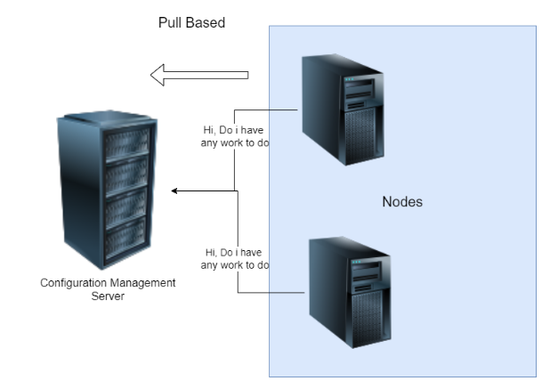

* Required : 
=> Agent needs to be installed with necessary credentials to connect to CM Server

* Popular tools :
=> chef
=> puppet

### PUSH based Configuration Management :

* Communication direction => CM Server to Node

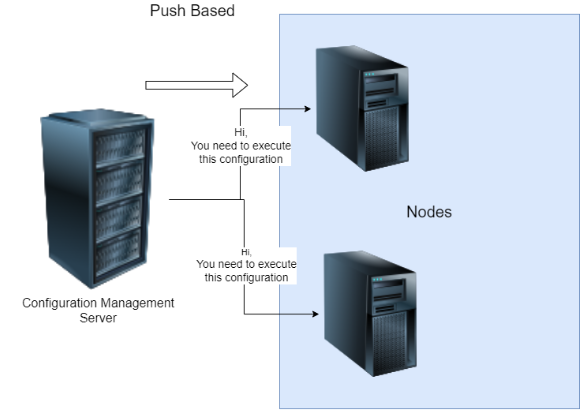

* Required :
=> List of nodes (inventory)
=> Credentials to login into node

* Popular tools :
=> Ansible
=> SaltStack

# Ansible
* Referrence : https://docs.ansible.com/ 

## Architecture and Workflow

* Basic workflow

* In this it is a push based configuration management
* Here the control node can execute desired state on nodes using
=> adhoc commands
=> playbooks (YAML files)

## How organisations work over multiple sever scenerio

* They have many a servers and admins
* And creating individual logins for each of them is not possible/feasible
* So, they create a service account for the admins to login and perform administration

* Let's our service account’s name  be devops
* Having username and password is not a sensible way so we use keypair based authentication

## Key pair authetication using RSA (Rivest, Shamir, Adleman)

* In this we generate two keys (i.e., public and private) of some mathematical prime number calulations

=> Public key : It comprises of two numbers, in which one number is the result of the product of two large prime numbers. This key is provided to all the users.

=> Private key : It is derived from the two prime numbers involved in public key and it always remains private. 

* To create a keypair use : 'ssh-keygen' command

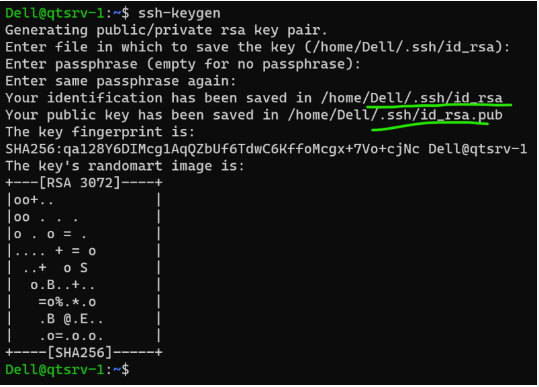

* Now the public key to linux machine 'ssh-copy-id < username >@ipaddess'

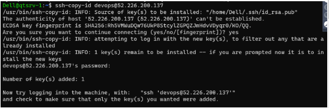

* Connect to the machine using private key 'ssh -i < path-to-private key > username@ipaddress'
* Generally private keys created will have extension of .pem (i.e we create a Service account public and private key). 
* Copy the service account public key to all the servers and also disable the password based authentication

## Setting up sudo permissions

* We need to add devops user to the sudoers group (Wheel in Redhat server)
* We use 'sudo visudo' command

## Evironment setup (Installing and configuring) for Ansible

* Start two linux machines(vms) and rename them as Ansible control node and node(s)

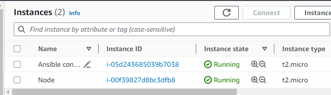

[ Note: (This is done in both the machines)
To enable password authentications edit config 'sudo vi /etc/ssh/sshd_config' and set 'PasswordAuthentication to yes' ] 

=> Now need to restart the service, 'sudo service sshd restart'

* Create a service account/user('sudo adduser devops') in all machines with sudo permissions('sudo visudo') (This is to be done on both the machines)

[ Note : Login into both the machines as devops user using 'ssh devops@< same machine public_IPaddress >']

[ Optional: as both machines are in the same network we can also use private_IPaddress of other machine to connect instead of public_IPaddress ]

* Install Ansible on the control node using commands only on the control node :

-> sudo apt update
-> sudo apt install software-properties-common -y
-> sudo add-apt-repository --yes --update ppa:ansible/ansible
-> sudo apt install ansible -y
-> ansible --version

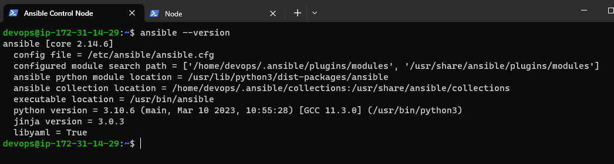

[ Optional: Disable password based authentication ]

* Create a keypair using 'ssh-keygen' and copy the ssh-key to the node(private_ip also works) machine using 'ssh-copy-id devops@< node machine public_IPaddress >'

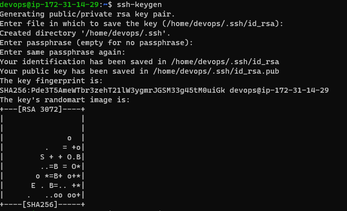

* Try logging into the node machine from the control node machine using 'ssh < other machine IPaddress >' (private IP address also works) and then logout 'exit'

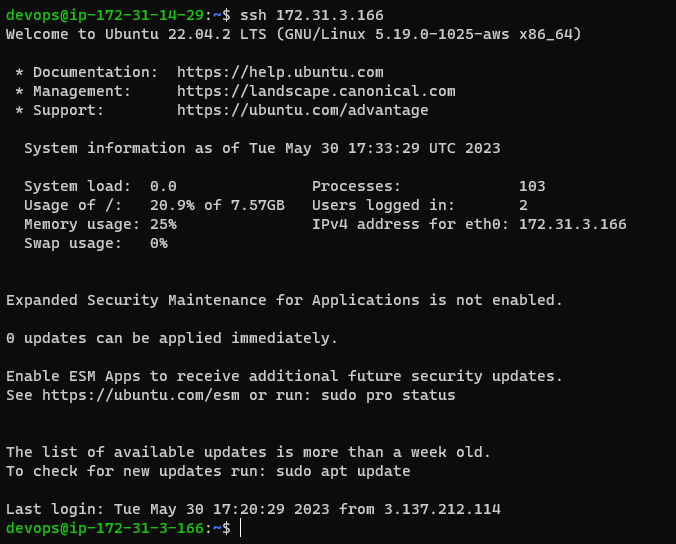

* Adding inventory ('mkdir inventory') - Create a file named hosts ( 'vi inventory/hosts') with entry (public-IP of the node) (private-IP works when machines in same network)
* Check connectivity by executing 'ansible -i inventory/hosts -m ping all'

## Communication types

* Ansible can communicate with nodes by using two approaches :

1. adhoc commands : (build command for desired state)

* command uses the /usr/bin/ansible command-line tool to automate a single task on one or more managed nodes.
* These are quick and easy, but they are not reusable.
* These demonstrate the simplicity and power of Ansible. The concepts will port over directly to the playbook language.
* These are great for tasks you repeat rarely.

Syntax : ansible [pattern] -m [module] -a "[module options]"

E.g : For Gathering facts
      'ansible all -m ansible.builtin.setup'

2. Playbook : (create file for desired state)

* These offer a repeatable, re-usable, simple configuration management and multi-machine deployment system (well suited to deploying complex applications).
* If you need to execute a task with Ansible more than once, write a playbook and put it under source control,then you can use the playbook to push out new configuration or confirm the configuration of remote systems.
* Playbooks with multiple ‘plays’ can orchestrate multi-machine deployments, running one play on your webservers, then another play on your database servers, then a third play on your network infrastructure, and so on
* Here smallest unit of work is done by module 

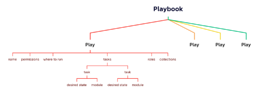

Syntax : YAML format 

 * Running a playbook 
    ('ansible-playbook -i < inventory-path > < playbook-path >')
* YAML supports yes-no for true-false unlike JASON

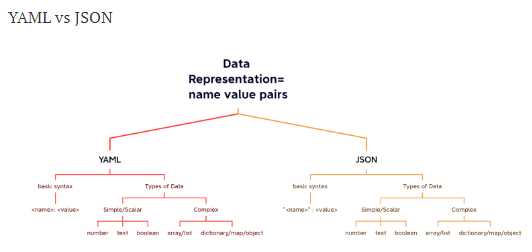

## Sample playbook execution
 
* Complete the entire Ansible control node - node setup
* Create inventory and add node hosts
  * mkdir inventory
  * vi inventory/hosts
* Create a directory and add a yaml file
  * mkdir playbooks
  * vi playbooks/hello.yml

 Playbook : playbooks/hello.yml 

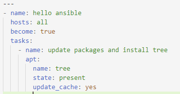
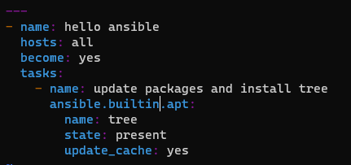

Commands to execute :

* ansible-playbook -i inventory/hosts --syntax-check playbooks/hello.yml
* ansible-playbook -i inventory/hosts --list-hosts playbooks/hello.yml
* ansible-playbook -i inventory/hosts playbooks/hello.yml

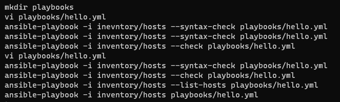

* Check for output on node machine 

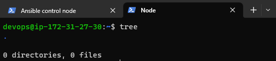

## WOW (Ways Of Working)

1. list down all the manual steps
2. Ensure all the steps are working
3. For each step find a module and express the desired state

## Sample-1 : Install apache server

 Manual steps :

* sudo apt update
* sudo apt install apache2 -y
* Verify installation 'http://public-ip' 

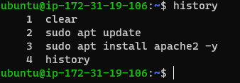

Playbook steps :

* Complete the entire Ansible control node - node setup
* Create inventory and add node hosts
  -> mkdir inventory
  -> vi inventory/hosts
* create a directory and add a yaml file
  -> mkdir playbooks
  -> vi playbooks/apache2.yml

 Playbook : playbooks/apache2.yml 

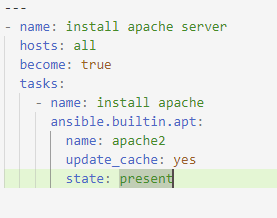
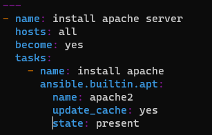

Commands to execute :

* ansible-playbook -i inventory/hosts --syntax-check playbooks/apache2.yml
* ansible-playbook -i inventory/hosts --list-hosts playbooks/apache2.yml
* ansible-playbook -i inventory/hosts playbooks/apache2.yml

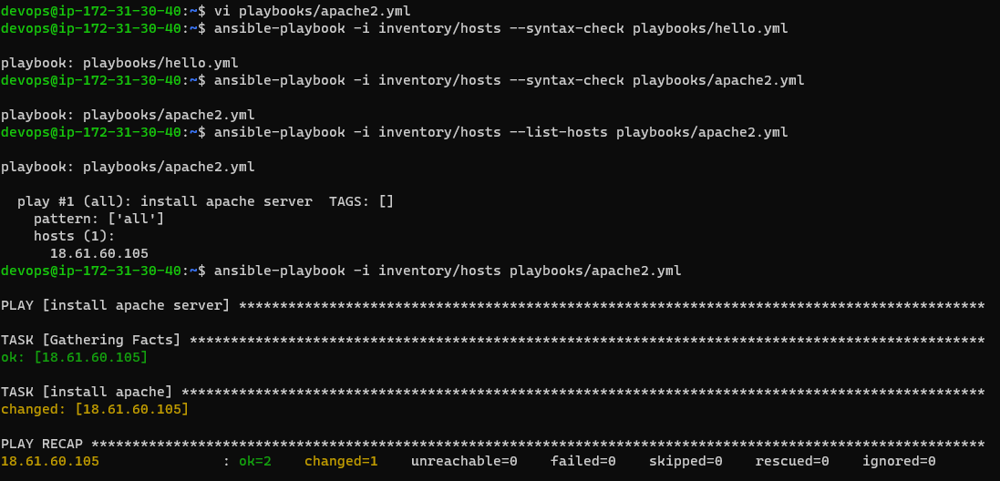

* Check status on the node 'sudo systemctl status apache2'
* Expose using node IPaddress

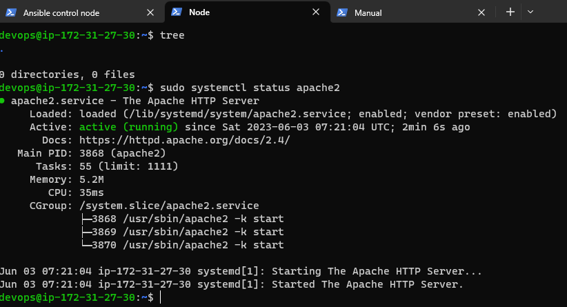

## Sample-2 : Install LAMP server on ubuntu
   ( skipping mysql installation )

 Manual steps :

* sudo apt update
* sudo apt install apache2 -y
* sudo apt install php libapache2-mod-php php-mysql -y
 
 [# Create a file called as /var/www/html/info.php with below content
#(?php phpinfo(); ?) ]

* sudo -i
* echo '<?php phpinfo(); ?>' > /var/www/html/info.php
* exit
* sudo systemctl restart apache2
* Verify installation 'http://public-ip/info.php' 

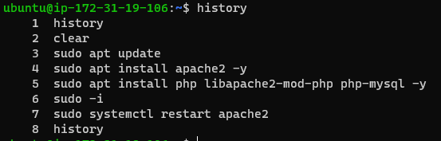

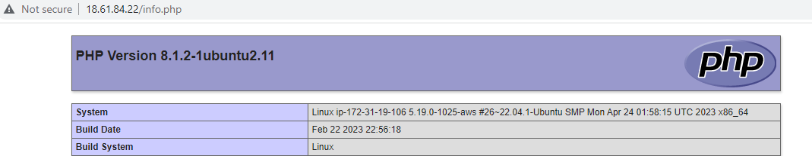

Playbook steps :

* Complete the entire Ansible control node - node setup
* Create inventory and add node hosts
  -> mkdir inventory
  -> vi inventory/hosts
* create a directory and add a yaml file
  -> mkdir playbooks
  -> vi playbooks/lamp-ubuntu.yml
* For writing playbook we first search for module as 'apt in ansible'
* Now select parameters

 Playbook : playbooks/lamp-ubuntu.yml

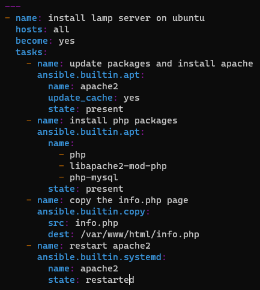

playbook/info.php

* <?php phpinfo(); ?>

Commands to execute :

* ansible-playbook -i inventory/hosts --syntax-check playbooks/lamp-ubuntu.yml
* ansible-playbook -i inventory/hosts --list-hosts playbooks/lamp-ubuntu.yml
* ansible-playbook -i inventory/hosts playbooks/lamp-ubuntu.yml

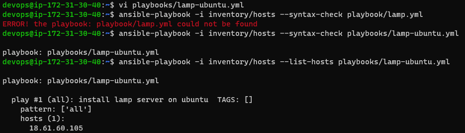

* Check status on node and expose with node IPaddress

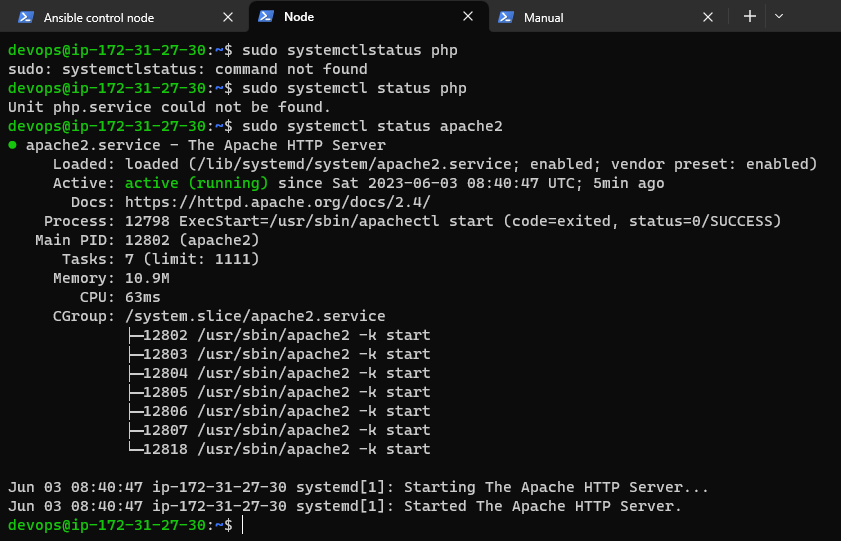

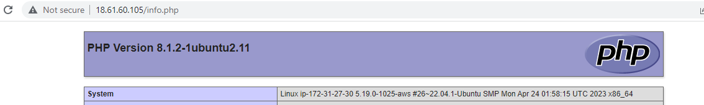

## Sample-3 : Install LAMP stack on Redhat9
   ( skipping mysql installation )

 Manual steps :

* sudo yum install httpd -y
* sudo systemctl enable httpd
* sudo systemctl start httpd
* sudo yum install php -y
* sudo -i
* echo '<?php phpinfo(); ?>' > /var/www/html/info.php
* exit
* sudo systemctl restart httpd
* Verify installation 'http://public-ip/info.php' 

Playbook steps :

* Complete the entire Ansible control node - node setup
* Create inventory and add node hosts
  -> mkdir inventory
  -> vi inventory/hosts
* create a directory and add a yaml file
  -> mkdir playbooks
  -> vi playbooks/lamp-redhat.yml

 Playbook : playbooks/lamp-redhat.yml

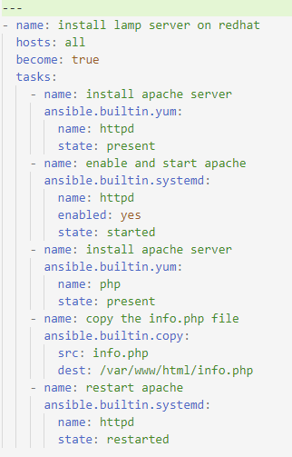

playbooks/info.php

* <?php phpinfo(); ?>

Commands to execute :

* ansible-playbook -i inventory/hosts --syntax-check playbooks/lamp-redhat.yml
* ansible-playbook -i inventory/hosts --list-hosts playbooks/lamp-redhat.yml
* ansible-playbook -i inventory/hosts playbooks/lamp-redhat.yml

## METRIC BEATS INSTALLATION

 Manual steps (using apt package):
       
* wget -q0 – https://artifacts.elastic.co/GPG-KEY-elasticsearch | sudo apt-key add -
* sudo apt-get install apt-transport-https
* echo “deb https://artifacts.elastic.co/packages/8.x/apt stable main” | sudo tee -a /etc/apt/sources.list.d/elastic-8.x.list
* sudo apt-get update && sudo apt-get install metricbeat
* sudo systemctl enable metricbeat
* sudo systemctl start metricbeat
* sudo systemctl status metricbeat
 
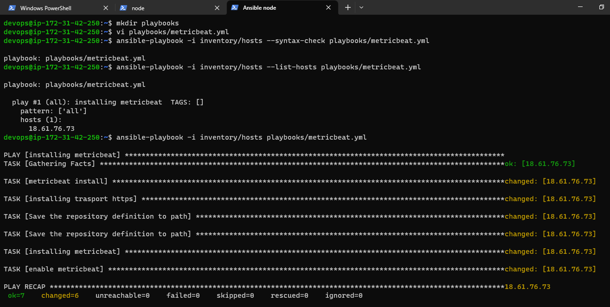
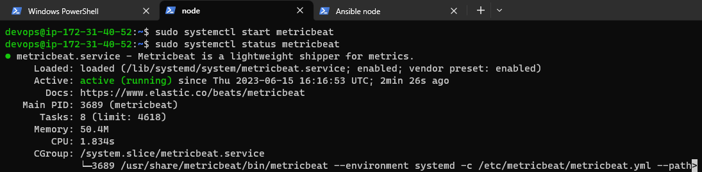

playbook : playbooks/metricbeat.yml

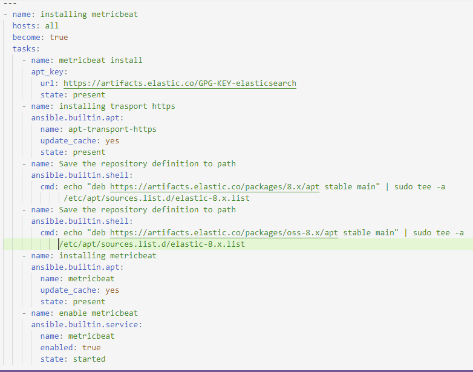

Commands to execute :

* ansible-playbook -i inventory/hosts --syntax-check playbooks/metricbeat.yml
* ansible-playbook -i inventory/hosts --list-hosts playbooks/metricbeat.yml
* ansible-playbook -i inventory/hosts playbooks/metricbeat.yml  

## Handlers

* Sometimes you want a task to run only when a change is made on a machine. 
* For example, you may want to restart a service if a task updates the configuration of that service, but not if the configuration is unchanged.Ansible uses handlers to address this use case. 
* Handlers are tasks that only run when notified.

### E.g.1 : playbooks/redhat.yaml

Commands to execute :

* ansible-playbook -i inventory/hosts --syntax-check playbooks/redhat.yml
* ansible-playbook -i inventory/hosts --list-hosts playbooks/redhat.yml
* ansible-playbook -i inventory/hosts playbooks/redhat.yml

### E.g.2 : playbooks/ubuntu.yaml

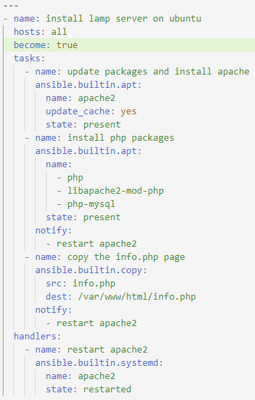

Commands to execute :

* ansible-playbook -i inventory/hosts --syntax-check playbooks/ubuntu.yml
* ansible-playbook -i inventory/hosts --list-hosts playbooks/ubuntu.yml
* ansible-playbook -i inventory/hosts playbooks/ubuntu.yml   

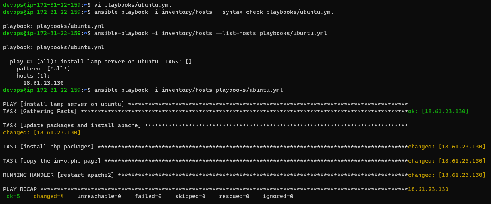
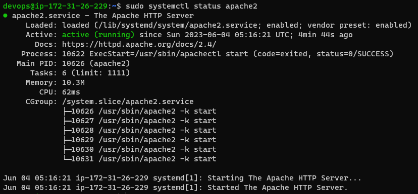

* Check the output using node IPaddress and also add /info.php and reload

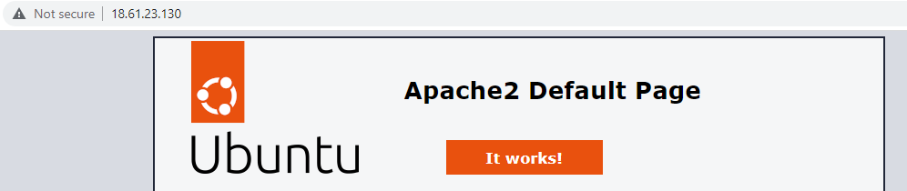
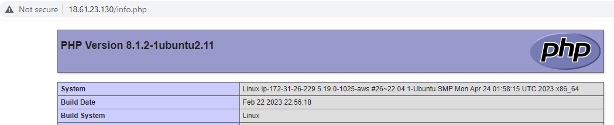

## Inventory

* Inventory in Ansible represents the hosts which we need to connect to.
* Ansible inventory is broadly classified into two types :
  (a) Static inventory: 
   * where we mention the list of nodes to connect to (in a file)
  (b) Dynamic inventory: 
    * where we mention some script/plugin which will dynamically find out the nodes to connect to

## Static inventory

* Static inventory can be mentioned in two formats :

  (a) INI format

  * It is a configuration file that consists of a text-based content with a structure and syntax comprising key–value pairs for properties and sections that organize the properties
  * The headings in brackets are group names, which are used in classifying hosts and deciding what hosts you are controlling at what times and for what purpose. 

E.g : INI format - hosts.ini
  
        [ubuntu]
        172.31.27.136

        [redhat]
        172.31.23.22

        [webserver]
        172.31.27.136
        172.31.23.22

  (b) YAML format

  * It is a configuration file that consists of a text-based content with a structure and syntax comprising key–value pairs for properties and sections that organize the properties

E.g : YAML format - hosts.yml
  

        all:
          children:
            ubuntu:
              hosts:
                172.31.27.136:
            redhat:
              hosts:
                172.31.23.22:
            webserver:
              hosts:
                172.31.27.136:
                172.31.23.22:
 
 ## Facts

 * Ansible collects information about the node on which it is executing by the help of module called as 'setup'
* Playbook by default collects information about nodes where it is executing, we can use this with the help of variables
* To display the information we use 'ansible -m 'setup' -i 'localhost, ' all' command and get a JSON format info
* Collecting information can be disabled as well

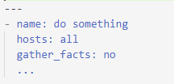

* In the playbook the facts will be collected and will be available in a special variables ansible_facts

playbook : playbooks/distribution.yml

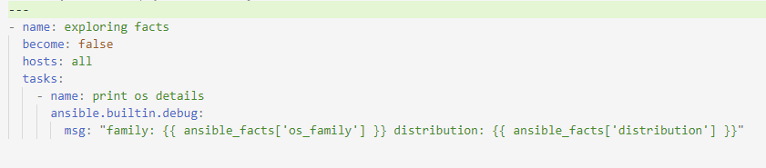
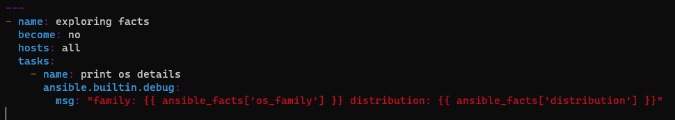

* The statement ansible_facts['os_family'] represents accessing os family from the facts collected
* From facts the variables can be accessed with full names ansible_default_ipv4 or ansible_facts['default_ipv4']

Commands to execute :

* ansible-playbook -i inventory/hosts --syntax-check playbooks/distribution.yml
* ansible-playbook -i inventory/hosts --list-hosts playbooks/distribution.yml
* ansible-playbook -i inventory/hosts playbooks/distribution.yml        

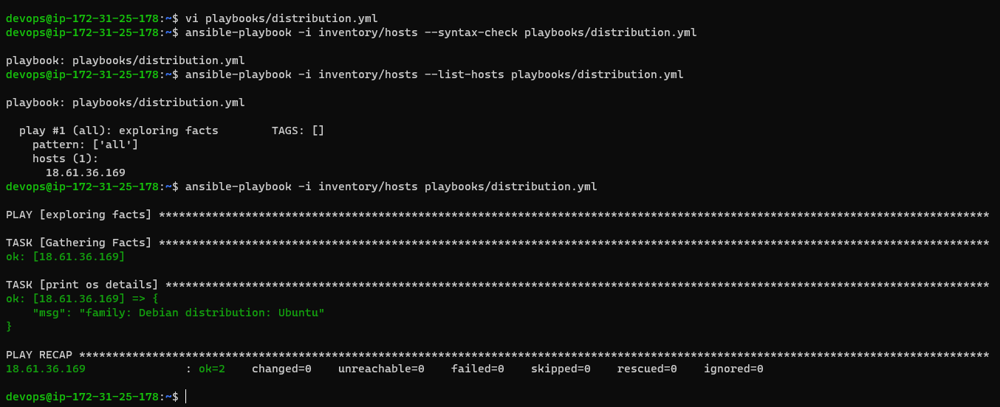

playbook : playbooks/ipv4.yml

Commands to execute :

* ansible-playbook -i inventory/hosts --syntax-check playbooks/ipv4.yml
* ansible-playbook -i inventory/hosts --list-hosts playbooks/ipv4.yml
* ansible-playbook -i inventory/hosts playbooks/ipv4.yml        

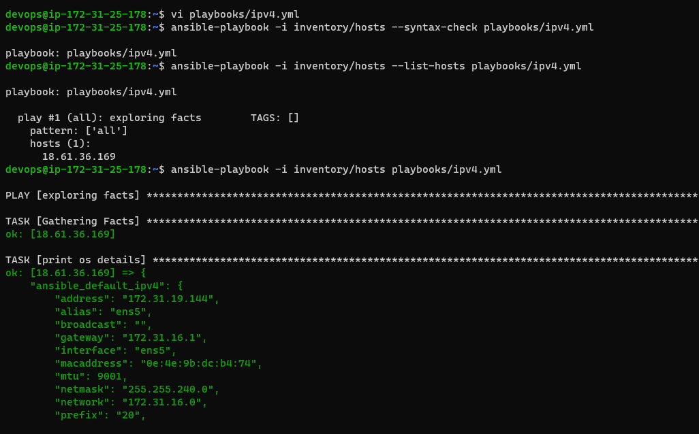
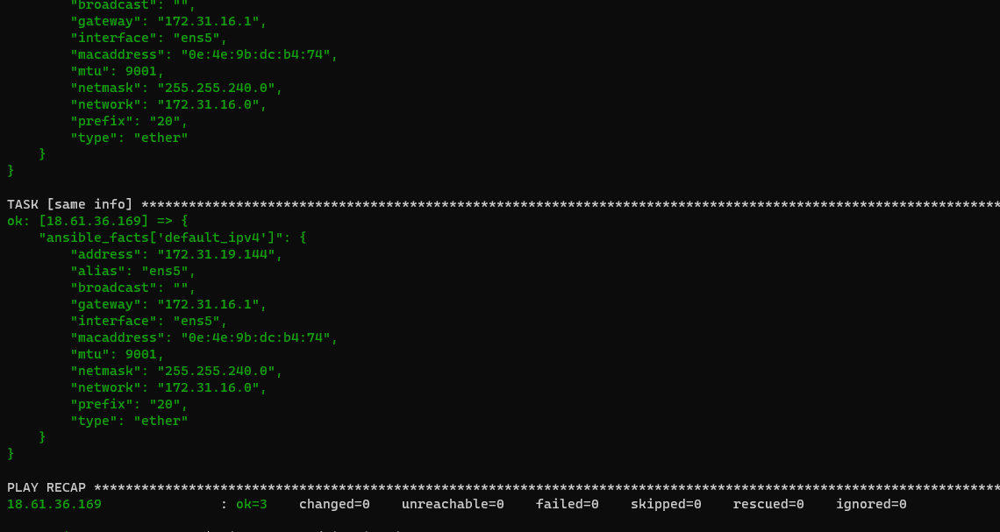

## Conditionals

* In a playbook, you may want to execute different tasks, or have different goals, depending on the value of a fact (data about the remote system), a variable, or the result of a previous task. 
* You may want the value of some variables to depend on the value of other variables (or) you may want to create additional groups of hosts based on whether the hosts match other criteria. You can do all of these things with conditionals.

playbook : playbooks/factsdemo.yml

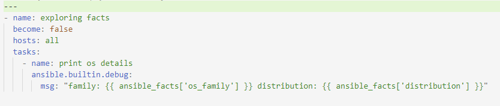
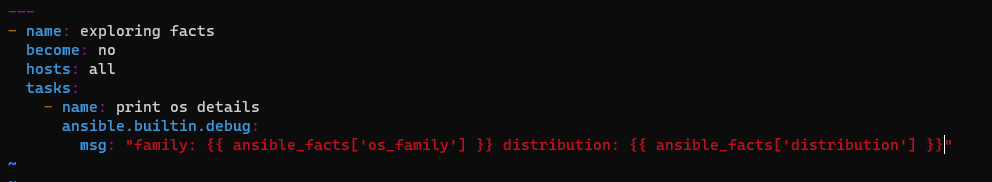

Commands to execute :

* ansible-playbook -i inventory/hosts --syntax-check playbooks/factsdemo.yml
* ansible-playbook -i inventory/hosts --list-hosts playbooks/factsdemo.yml
* ansible-playbook -i inventory/hosts playbooks/factsdemo.yml        

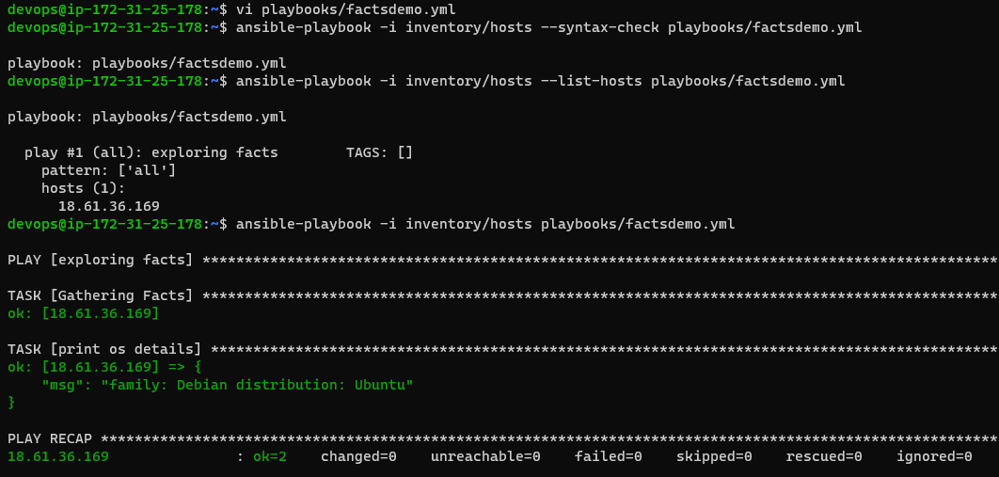

playbook : playbooks/combined.yml

---
- name: install lamp server on ubuntu
  hosts: redhat
  become: yes
  tasks:
    - name: install httpd server
      ansible.builtin.yum:
        name: httpd
        state: present
      when: ansible_facts['os_family'] == 'RedHat'
    - name: enable and start httpd
      ansible.builtin.systemd:
        name: httpd
        enabled: yes
        state: started
      when: ansible_facts['os_family'] == 'RedHat'
    - name: install httpd php server
      ansible.builtin.yum:
        name: php
        state: present
      notify:
        - restart apache
      when: ansible_facts['os_family'] == 'RedHat'
    - name: copy the info.php file in httpd
      ansible.builtin.copy:
        src: info.php
        dest: /var/www/html/info.php
      notify:
        - restart apache
      when: ansible_facts['os_family'] == 'RedHat'
    - name: update packages and install apache
      ansible.builtin.apt:
        name: apache2
        update_cache: yes
        state: present
      when: ansible_facts['os_family'] == 'Ubuntu'
    - name: install php packages
      ansible.builtin.apt:
        name:
          - php
          - libapache2-mod-php
          - php-mysql
        state: present
      notify:
        - restart apache2
      when: ansible_facts['os_family'] == 'Ubuntu'
    - name: copy the info.php page
      ansible.builtin.copy:
        src: info.php
        dest: /var/www/html/info.php
      notify:
        - restart apache2
      when: ansible_facts['os_family'] == 'Ubuntu'
  handlers:
    - name: restart apache
      ansible.builtin.systemd:
        name: httpd
        state: restarted
    - name: restart apache2
      ansible.builtin.systemd:
        name: apache2
        state: restarted

Commands to execute :

* ansible-playbook -i inventory/hosts --syntax-check playbooks/combined.yml
* ansible-playbook -i inventory/hosts --list-hosts playbooks/combined.yml
* ansible-playbook -i inventory/hosts playbooks/combined.yml        

## NOPCOMMERCE INSTALLATION

 Manual steps (using apt package):

 => Install dotnet core7

    * wget https://packages.microsoft.com/config/ubuntu/20.04/packages-microsoft-prod.deb -O packages-microsoft-prod.deb
    * sudo dpkg -i packages-microsoft-prod.deb
    * rm packages-microsoft-prod.deb
    * sudo apt-get update && \
      sudo apt-get install -y dotnet-sdk-7.0

 => Downloading nopcommerce zip and unzip

    * sudo apt install unzip -y
    * sudo mkdir /usr/share/nopCommerce
    * cd /usr/share/nopCommerce/
    * sudo wget https://github.com/nopSolutions/nopCommerce/releases/download/release-4.60.3/nopCommerce_4.60. 3_NoSource_linux_x64.zip
    * sudo unzip nopCommerce_4.60.3_NoSource_linux_x64.zip
    * sudo mkdir bin
    * sudo mkdir logs
    * cd ~
 => Creating user nop and giving full permissions

    * sudo adduser nop
    * sudo chgrp -R nop /usr/share/nopCommerce/
    * sudo chown -R nop /usr/share/nopCommerce/

=> Adding a service file

   * sudo vi /etc/systemd/system/nopCommerce.service
       
  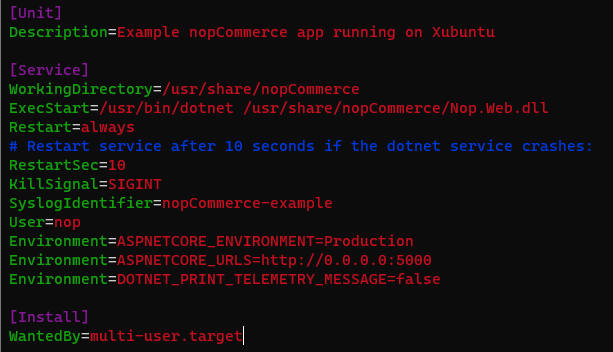

   * sudo systemctl enable nopCommerce.service
   * sudo systemctl start nopCommerce.service
   * sudo systemctl status nopCommerce.service

  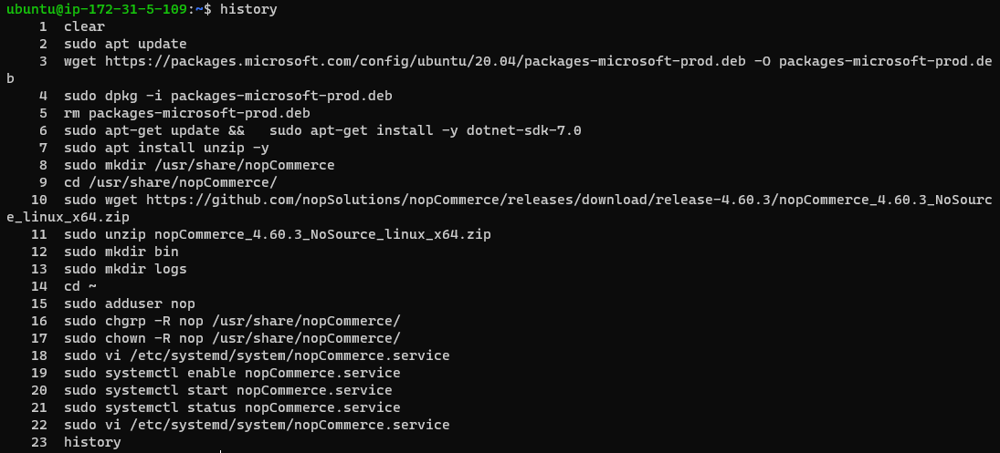
  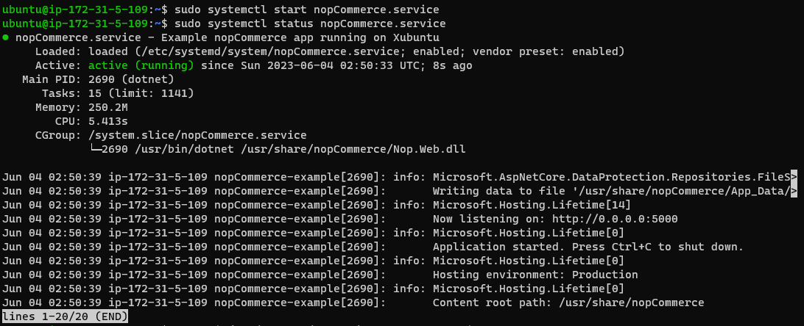

* Expose the nopcommerce with the < public_ip:5000>

  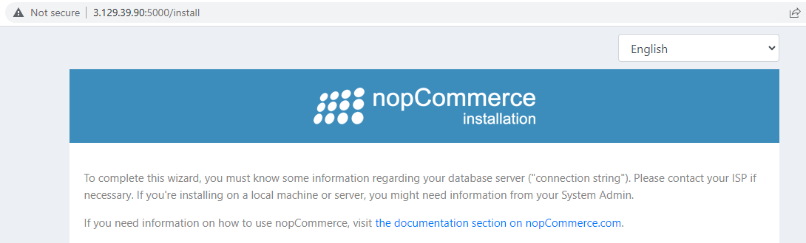
 
playbook : playbooks/nop.yml

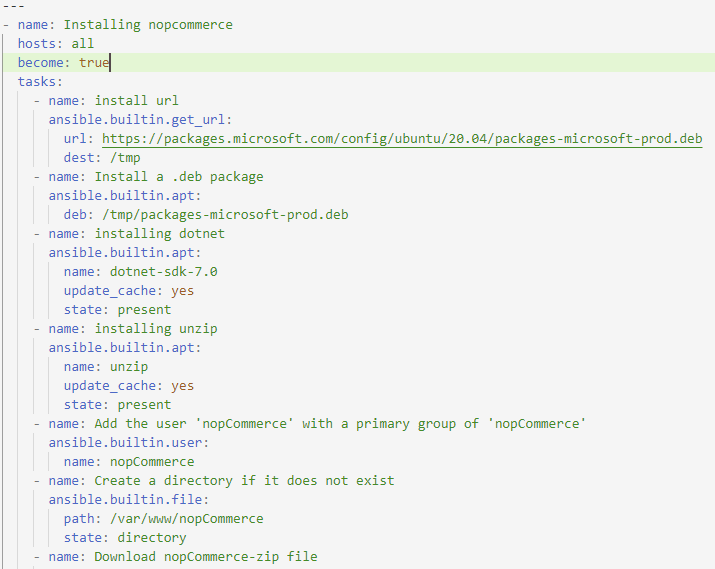
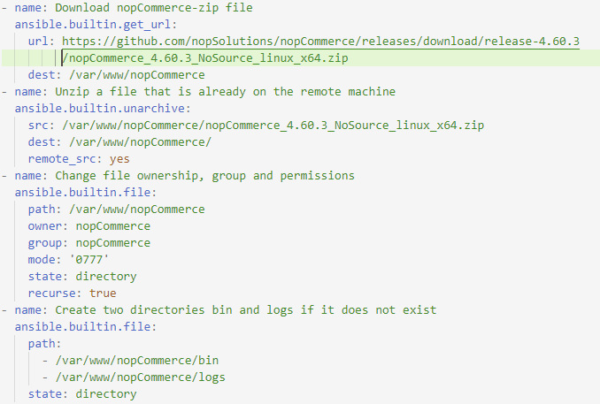
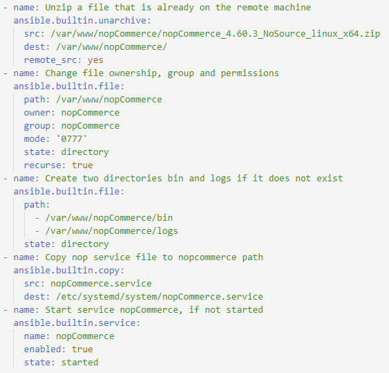

service-file : playbooks/nop.service


Commands to execute :

* ansible-playbook -i inventory/hosts --syntax-check playbooks/nop.yml
* ansible-playbook -i inventory/hosts --list-hosts playbooks/nop.yml
* ansible-playbook -i inventory/hosts playbooks/nop.yml


* Expose the '< public_IPaddress of node >:5000'


## OPEN-MRS INSTALLATION

=> URL : https://www.linuxcloudvps.com/blog/how-to-install-openmrs-on-ubuntu-20-04/

 Manual steps (using apt package): ( skipping mysql installation)

 * Switch as root user
 * apt-get update -y

 => Install Java 8

* apt-get install openjdk-8-jdk -y
* java -version


=> Installing tomcat7

* groupadd tomcat
useradd -s /bin/false -g tomcat -d /opt/tomcat tomcat
* wget https://archive.apache.org/dist/tomcat/tomcat-7/v7.0.109/bin/apache-tomcat-7.0.109.tar.gz
* mkdir /opt/tomcat
tar -xvzf apache-tomcat-7.0.109.tar.gz -C /opt/tomcat/ --strip-components=1
* cd /opt/tomcat
chgrp -R tomcat /opt/tomcat
chmod -R g+r conf
chmod g+x conf
chown -R tomcat webapps/ work/ temp/ logs/

=> Create a Systemd Service File for Tomcat

* nano /etc/systemd/system/tomcat.service


* systemctl daemon-reload
* systemctl start tomcat
* systemctl status tomcat


* At this point, Tomcat is started and listens on port 8080


=> Install OpenMRS

* mkdir /var/lib/OpenMRS
chown -R tomcat:tomcat /var/lib/OpenMRS
* wget https://sourceforge.net/projects/openmrs/files/releases/OpenMRS_Platform_2.5.0/openmrs.war
* cp openmrs.war /opt/tomcat/webapps/
* chown -R tomcat:tomcat /opt/tomcat/webapps/openmrs.war
* Access OpenMRS using : 'http://your-server-ip:8080/openmrs'


 playbook : playbooks/openmrs.yml


 service-file : playbooks/tomcat.service


Commands to execute :

* ansible-playbook -i inventory/hosts --syntax-check playbooks/openmrs.yml
* ansible-playbook -i inventory/hosts --list-hosts playbooks/openmrs.yml
* ansible-playbook -i inventory/hosts playbooks/openmrs.yml


* Expose the application '<public_IPaddress:8080>'


     
## BROADLEAF INSTALLATION

=> URL :  https://github.com/BroadleafCommerce

 Manual steps (using apt package):

* sudo apt update
* git clone https://github.com/BroadleafCommerce/DemoSite.git


* sudo -i
* apt install maven -y
* mvn -version
* exit


* cd DemoSite/
* mvn clean install
* cd site/
* mvn spring-boot:run


* Expose the broadleaf with the '< public_IPaddress>:8080'


playbook : playbooks/broadleaf.yml


Jinja-service-file : playbooks/broadleaf.service.j2


Commands to execute :

* ansible-playbook -i inventory/hosts --syntax-check playbooks/broadleaf.yml
* ansible-playbook -i inventory/hosts --list-hosts playbooks/broadleaf.yml
* ansible-playbook -i inventory/hosts playbooks/broadleaf.yml


* Expose the '< public_IPaddress of node >:8080'

## VARIABLES

* Ansible uses variables to manage differences between systems. 
* With Ansible, you can execute tasks and playbooks on multiple different systems with a single command. 
* To represent the variations among those different systems, you can create variables with standard YAML syntax, including lists and dictionaries. 
* You can define these variables in your playbooks, in your inventory, in re-usable files or roles, or at the command line. 
* Not all strings are valid Ansible variable names. A variable name can only include letters, numbers, and underscores.

=> Let's take example of the 'combined.yml' file

1. Add variables in inventory and other in playbook


## ansible.builtin.package module – Generic OS package manager

* In most cases, you can use the short module name package even without specifying the collections: keyword. 

2. Using packaging module (Generic package manager) instead of using apt/yum packages for apache

* Using package instead of apt/yum for installing apache


## Loops

* Ansible offers the loop, with_<lookup>, and until keywords to execute a task multiple times. 
* Examples of commonly-used loops include changing ownership on several files and/or directories with the file module, creating multiple users with the user module, and repeating a polling step until a certain result is reached.

3. with loops and using loops from variables


=> Variables at the inventory level need not be in inventory file

4. with host_vars and group_vars


5.  to fail playbook explicitly on unsupported os


6. Debug messages


