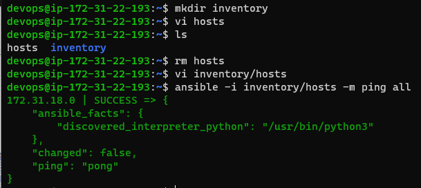

## Introduction

* Used for the applications which is accessed globally .
* Written once and applicable over various os flavours (servers too) .
* When frequent updates to be made into all the systems used in an organisation .

## Deployment options 

* We can have mainly two deployment approaches :
1. Declarative approach
2. Procedural approach

* Configuration management is the declarative deployment which ensures :
1. Idempotence : Run this once or n times you will have same result 
2. Desired state : We express configuration to acheive a desired state 
3. Reusable

## Configuration Management (CM)

* There are two types :
1. PULL based configuration
2. PUSH based configuration

### PULL based Configuration Management :

* Communication direction => Node to CM server

* Required : 
=> Agent needs to be installed with necessary credentials to connect to CM Server

* Popular tools :
=> chef
=> puppet

### PUSH based Configuration Management :

* Communication direction => CM Server to Node

* Required :
=> List of nodes (inventory)
=> Credentials to login into node

* Popular tools :
=> Ansible
=> SaltStack

# Ansible
* Referrence : https://docs.ansible.com/ 

## Architecture and Workflow

* Basic workflow

* In this it is a push based configuration management
* Here the control node can execute desired state on nodes using
=> adhoc commands
=> playbooks (YAML files)

## How organisations work over multiple sever scenerio

* They have many a servers and admins
* And creating individual logins for each of them is not possible/feasible
* So, they create a service account for the admins to login and perform administration

* Let's our service account’s name  be devops
* Having username and password is not a sensible way so we use keypair based authentication

## Key pair authetication using RSA (Rivest, Shamir, Adleman)

* In this we generate two keys (i.e., public and private) of some mathematical prime number calulations

=> Public key : It comprises of two numbers, in which one number is the result of the product of two large prime numbers. This key is provided to all the users.

=> Private key : It is derived from the two prime numbers involved in public key and it always remains private. 

* To create a keypair use : 'ssh-keygen' command

* Now the public key to linuxmachine 'ssh-copy-id username@ipaddess'

* connect to the machine using private key 'ssh -i <path-to-private key> username@ipaddress'
* Generally private keys created will have extension of .pem i.e we create a Service account public and private key. 
* Copy the service account public key to all the servers and also disable the password based authentication

## Setting up sudo permissions

* We need to add devops user to the sudoers group (Wheel in Redhat server)
* We use 'sudo visudo' command

## Evironment setup (Installing and configuring) for Ansible

* Start two linux machines(vms) and rename them as Ansible control node and node(s)

[ Note: (This is done in both the machines)
To enable password authentications edit config 'sudo /etc/ssh/sshd_config' and set 'PasswordAuthentication to yes' ] 

=> Now need to restart the service, 'sudo service sshd restart'

* Create a service account/user('sudo adduser devops') in all machines with sudo permissions('sudo visudo') (This is to be done in both the machines)

[ Note : Login into both the machines as devops user using 'ssh devops@IPaddress']

[ Optional: as both machines are in the same network we can also use private ipaddress of other machine to connect instead of public ipaddress ]

* Install Ansible on the control node using commands only on the control node :

-> sudo apt update
-> sudo apt install software-properties-common -y
-> sudo add-apt-repository --yes --update ppa:ansible/ansible
-> sudo apt install ansible -y

* Verify ansible version ('ansible --version')

[ Optional: Disable password based authentication ]

* Create a keypair using 'ssh-keygen' and copy the sshkey to the node(private ip also works) machine using 'ssh-copy-id devops@IPaddress'

* Try logging into the node machine from the control node machine using 'ssh IPaddress' (private IP address also works) and then logout 'exit'

* Adding inventory ('mkdir inventory') - Create a file named hosts ( 'vi inventory/hosts') with entry (public-IP of the node) (private-IP works when machines in same network)
* Check connectivity by executing 'ansible -m ping -i inventory/hosts all'

## Communication types

* Ansible can communicate with nodes by using two approaches :

1. adhoc commands : (build command for desired state)

* command uses the /usr/bin/ansible command-line tool to automate a single task on one or more managed nodes.
* These are quick and easy, but they are not reusable.
* These demonstrate the simplicity and power of Ansible. The concepts will port over directly to the playbook language.
* Theses are great for tasks you repeat rarely.

Syntax : ansible [pattern] -m [module] -a "[module options]"

E.g : For Gathering facts
      'ansible all -m ansible.builtin.setup'

2. Playbook : (create file for desired state)

* These offer a repeatable, re-usable, simple configuration management and multi-machine deployment system (well suited to deploying complex applications).
* If you need to execute a task with Ansible more than once, write a playbook and put it under source control,then you can use the playbook to push out new configuration or confirm the configuration of remote systems.
* Playbooks with multiple ‘plays’ can orchestrate multi-machine deployments, running one play on your webservers, then another play on your database servers, then a third play on your network infrastructure, and so on
* Here smallest unit of work is done by module 

Syntax : YAML format 

 * Running a playbook 
    ('ansible-playbook -i [inventory-path] [playbook-path]')
* YAML supports yes-no for true-false unlike JASON

## Sample playbook execution
 
* Complete the entire Ansible control node - node setup
* Create inventory and add node hosts
  * mkdir inventory
  * vi inventory/hosts
* Create a directory and add a yaml file
  * mkdir playbooks
  * vi playbooks/hello.yml

 Playbook : playbooks/hello.yml
   --- 
- name: hello ansible
  hosts: all
  become: yes
  tasks:
    - name: update packages and install tree
      apt:
        name: tree
        state: present
        update_cache: yes

Commands to execute :

* ansible-playbook -i inventory/hosts --syntax-check playbooks/hello.yml
* ansible-playbook -i inventory/hosts --check playbooks/ubuntu.yml
* ansible-playbook -i inventory/hosts --list-hosts playbooks/ubuntu.yml
* ansible-playbook -i inventory/hosts playbooks/hello.yml

## WOW (Ways Of Working)

1. list down all the manual steps
2. Ensure all the steps are working
3. For each step find a module and express the desired state

## Sample-1 : Install apache server

 Manual steps :

* sudo apt update
* sudo apt install apache2 -y
* Verify installation 'http://public-ip' 

Playbook steps :

* Complete the entire Ansible control node - node setup
* Create inventory and add node hosts
  -> mkdir inventory
  -> vi inventory/hosts
* create a directory and add a yaml file
  -> mkdir playbooks
  -> vi playbooks/apache2.yml
* For writing playbook we first search for module as 'apt in ansible'
* Now select parameters

 Playbook : playbooks/apache2.yml
---
- name: install apache server
  hosts: all
  become: yes
  tasks:
    - name: install apache
      ansible.builtin.apt:
        name: apache2
        update_cache: yes
        state: present

Commands to execute :

* ansible-playbook -i inventory/hosts --syntax-check playbooks/apache2.yml
* ansible-playbook -i inventory/hosts --check playbooks/apache2.yml
* ansible-playbook -i inventory/hosts --list-hosts playbooks/apache2.yml
* ansible-playbook -i inventory/hosts playbooks/apache2.yml

## Sample-2 : Install LAMP server on ubuntu
   ( skipping mysql installation )

 Manual steps :

* sudo apt update
* sudo apt install apache2 -y
* sudo apt install php libapache2-mod-php php-mysql -y
[# Create a file called as /var/www/html/info.php with below content
# <?php phpinfo(); ?>]
* sudo -i
* echo '<?php phpinfo(); ?>' > /var/www/html/info.php
* exit
* sudo systemctl restart apache2
* Verify installation 'http://public-ip/info.php' 

Playbook steps :

* Complete the entire Ansible control node - node setup
* Create inventory and add node hosts
  -> mkdir inventory
  -> vi inventory/hosts
* create a directory and add a yaml file
  -> mkdir playbooks
  -> vi playbooks/apache2.yml
* For writing playbook we first search for module as 'apt in ansible'
* Now select parameters

 Playbook : playbooks/lamp/ubuntu.yml
---
- name: install lamp server on ubuntu
  hosts: all
  become: yes
  tasks:
    - name: update packages and install apache
      ansible.builtin.apt:
        name: apache2
        update_cache: yes
        state: present
    - name: install php packages
      ansible.builtin.apt:
        name:
          - php
          - libapache2-mod-php
          - php-mysql
        state: present
    - name: copy the info.php page
      ansible.builtin.copy:
        src: info.php
        dest: /var/www/html/info.php
    - name: restart apache2
      ansible.builtin.systemd:
        name: apache2
        state: restarted

playbooks/lamp/info.php

* <?php phpinfo(); ?>

Commands to execute :

* ansible-playbook -i inventory/hosts --syntax-check playbooks/ubuntu.yml
* ansible-playbook -i inventory/hosts --check playbooks/ubuntu.yml
* ansible-playbook -i inventory/hosts --list-hosts playbooks/ubuntu.yml
* ansible-playbook -i inventory/hosts playbooks/ubuntu.yml

## Sample-3 : Install LAMP stack on Redhat9
   ( skipping mysql installation )

 Manual steps :

* sudo yum install httpd -y
* sudo systemctl enable httpd
* sudo systemctl start httpd
* sudo yum install php -y
* sudo -i
* echo '<?php phpinfo(); ?>' > /var/www/html/info.php
* exit
* sudo systemctl restart httpd
* Verify installation 'http://public-ip/info.php' 

Playbook steps :

* Complete the entire Ansible control node - node setup
* Create inventory and add node hosts
  -> mkdir inventory
  -> vi inventory/hosts
* create a directory and add a yaml file
  -> mkdir playbooks
  -> vi playbooks/apache2.yml
* For writing playbook we first search for module as 'apt in ansible'
* Now select parameters

 Playbook : playbooks/lamp/redhat.yml
---
- name: install lamp server on ubuntu
  hosts: all
  become: yes
  tasks:
    - name: install apache server
      ansible.builtin.yum:
        name: httpd
        state: present
    - name: enable and start apache
      ansible.builtin.systemd:
        name: httpd
        enabled: yes
        state: started
    - name: install apache server
      ansible.builtin.yum:
        name: php
        state: present
    - name: copy the info.php file
      ansible.builtin.copy:
        src: info.php
        dest: /var/www/html/info.php
    - name: restart apache
      ansible.builtin.systemd:
        name: httpd
        state: restarted

playbooks/lamp/info.php

* <?php phpinfo(); ?>

Commands to execute :

* ansible-playbook -i inventory/hosts --syntax-check playbooks/redhat.yml
* ansible-playbook -i inventory/hosts --check playbooks/redhat.yml
* ansible-playbook -i inventory/hosts --list-hosts playbooks/redhat.yml
* ansible-playbook -i inventory/hosts playbooks/redhat.yml

## Handlers

* Sometimes you want a task to run only when a change is made on a machine. 
* For example, you may want to restart a service if a task updates the configuration of that service, but not if the configuration is unchanged.Ansible uses handlers to address this use case. 
* Handlers are tasks that only run when notified.

E.g. : playbooks/lamp/redhat.yaml
---
- name: install lamp server on ubuntu
  hosts: all
  become: yes
  tasks:
    - name: install apache server
      ansible.builtin.yum:
        name: httpd
        state: present
    - name: enable and start apache
      ansible.builtin.systemd:
        name: httpd
        enabled: yes
        state: started
    - name: install apache server
      ansible.builtin.yum:
        name: php
        state: present
      notify:
        - restart apache
    - name: copy the info.php file
      ansible.builtin.copy:
        src: info.php
        dest: /var/www/html/info.php
      notify:
        - restart apache
  handlers:
    - name: restart apache
      ansible.builtin.systemd:
        name: httpd
        state: restarted

E.g. : playbooks/lamp/ubuntu.yaml
---
- name: install lamp server on ubuntu
  hosts: all
  become: yes
  tasks:
    - name: update packages and install apache
      ansible.builtin.apt:
        name: apache2
        update_cache: yes
        state: present
    - name: install php packages
      ansible.builtin.apt:
        name:
          - php
          - libapache2-mod-php
          - php-mysql
        state: present
      notify:
        - restart apache2
    - name: copy the info.php page
      ansible.builtin.copy:
        src: info.php
        dest: /var/www/html/info.php
      notify:
        - restart apache2
  handlers:
    - name: restart apache2
      ansible.builtin.systemd:
        name: apache2
        state: restarted

## Inventory

* Inventory in Ansible represents the hosts which we need to connect to.
* Ansible inventory is broadly classified into two types :
  1. Static inventory: 
   * where we mention the list of nodes to connect to (in a file)
  2. Dynamic inventory: 
    * where we mention some script/plugin which will dynamically find out the nodes to connect to

## Static inventory

* Static inventory can be mentioned in two formats :

  1. INI format

  * It is a configuration file that consists of a text-based content with a structure and syntax comprising key–value pairs for properties and sections that organize the properties
  * The headings in brackets are group names, which are used in classifying hosts and deciding what hosts you are controlling at what times and for what purpose. 

  E.g : INI format - hosts.ini
  
        [ubuntu]
        172.31.27.136

        [redhat]
        172.31.23.22

        [webserver]
        172.31.27.136
        172.31.23.22

  2. YAML format

  * It is a configuration file that consists of a text-based content with a structure and syntax comprising key–value pairs for properties and sections that organize the properties

  E.g : YAML format - hosts.yml
  
        ---
        all:
          children:
            ubuntu:
              hosts:
                172.31.27.136:
            redhat:
              hosts:
                172.31.23.22:
            webserver:
              hosts:
                172.31.27.136:
                172.31.23.22:
 